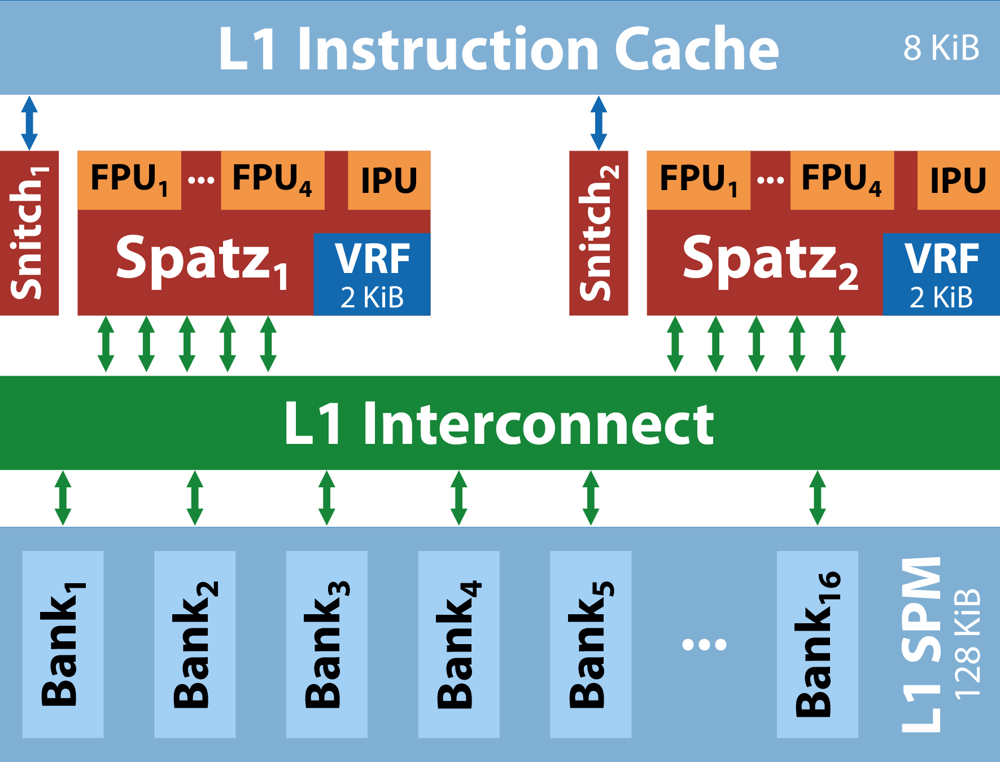
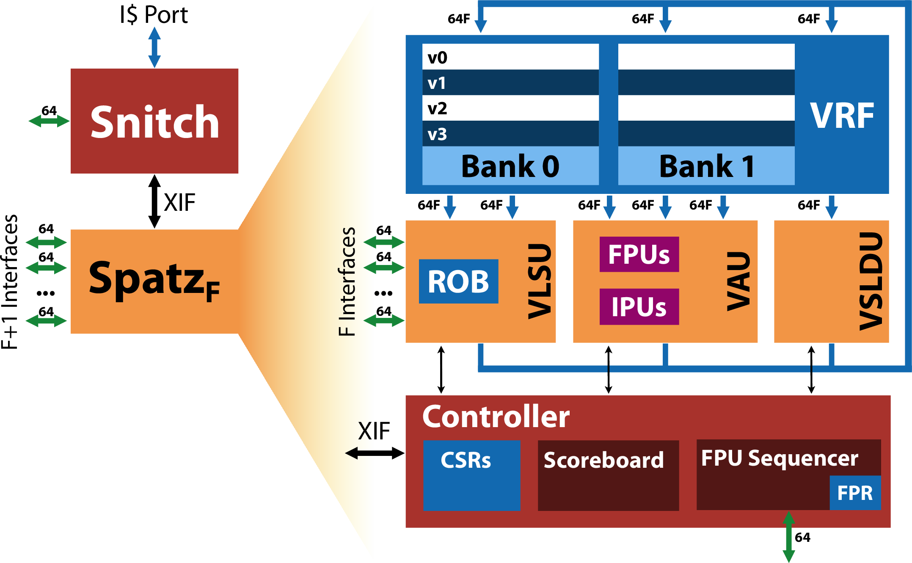

[](https://opensource.org/licenses/Apache-2.0)

# Spatz

Spatz is a compact vector processor based on [RISC-V's Vector Extension (RVV) v1.0](https://github.com/riscv/riscv-v-spec/releases/tag/v1.0). Spatz acts as a coprocessor of [Snitch](https://github.com/pulp-platform/snitch), a tiny 64-bit scalar core. It is developed as part of the PULP project, a joint effort between ETH Zurich and the University of Bologna.

## Getting started

Make sure you download all necessary dependencies:

```bash
make all
```

The Makefile target will automatically download and compile tested versions of LLVM, GCC, Spike, and Verilator. It might take a while. If you have issues cloning the GitHub modules, you might need to remove the folders in `sw/toolchain`.

ETH users can source the toolchains and initialize the environment by doing:

```bash

source util/iis-env.sh

make init
```

The Spatz cluster system (hw/system/spatz_cluster) is a fundamental system around a Snitch core and a Spatz coprocessor. The cluster can be configured using a config file. The configuration parameters are documented using JSON schema, and documentation is generated for the schema. The cluster testbench simulates an infinite memory. The RISC-V ELF file is preloaded using RISC-V's Front-end Server (`fesvr`).

### Simulating the system

In `hw/system/spatz_cluster`:

- Compile the software and the binaries:
  - Verilator:
```bash
    make sw.vlt
```
  - QuestaSim:
```bash
    make sw.vsim
```
  - VCS:
```bash
    make sw.vcs
```
- Run a binary on the simulator:
  - Verilator:
```bash
bin/spatz_cluster.vlt path/to/riscv/binary
```
  - QuestaSim:
```bash
# Headless
bin/spatz_cluster.vsim path/to/riscv/binary
# GUI
bin/spatz_cluster.vsim.gui path/to/riscv/binary
```
  - VCS
```bash
bin/spatz_cluster.vcs path/to/riscv/binary
```
- Build the traces in `.logs/trace_hart_X.txt` with the help of `spike-dasm`:
```bash
make traces
```
- Annotate the traces in `.logs/trace_hart_X.s` with the source code related to the retired instructions:
```bash
make annotate
```
- Get an overview of all Makefile targets:
```bash
make help
```

### Configure the Cluster

To configure the cluster with a different configuration, either edit the configuration files in the `cfg` folder or create a new configuration file and pass it to the Makefile:

```bash
make bin/spatz_cluster.vlt CFG=cfg/spatz_cluster.default.hjson
```

The default config is in `cfg/spatz_cluster.default.hjson`. Alternatively, you can also set your `CFG` environment variable, the Makefile will pick it up and override the standard config.

## Architecture

### Spatz cluster

Spatz was _not_ designed for full compliance with RVV. Check [Ara](https://github.com/pulp-platform/ara) for an open-source vector processor fully compliant with RVV (and by the same authors!). Instead, Spatz implements some instructions of the vector extension, enough to build a compact and highly efficient embedded vector processor. Thanks to its small size, Spatz is highly scalable, and we rely on multi-core vector processing to scale up the system.



The default Spatz cluster has two Snitch-Spatz core complexes (CCs), each with 2 KiB of latch-based VRF. Each CC has four [trans-precision FPUs](https://github.com/openhwgroup/cvfpu) with support for Spatz-specific SDOTP extensions for low-precision computing. The two Spatz-based CCs share access to 128 KiB of L1 scratchpad memory, divided into 16 SRAM banks.

### Spatz core

Each Spatz has three functional units:
- The Vector Arithmetic Unit (VAU), hosting `F` trans-precision FPUs and an integer computation unit. Each FPU supports fp8, fp16, fp32, and fp64 computation. Each IPU supports 8, 16, 32, and 64-bit computation. All units maintain a throughput of 64 bit/cycle regardless of the current Selected Element Width. The VAU also supports integer and floating-point reductions.
- The Vector Load/Store Unit (VLSU), with support for unit-strided, constant-strided, and indexed memory accesses. The VLSU supports a parametric number of 64-bit-wide memory interfaces. Thanks to the multiple narrow interfaces, Spatz can accelerate memory operations. By default, the number of 64-bit memory interfaces matches the number of FPUs in the design. **Important**, Spatz' VLSU cannot access the cluster's L2 memory. Ensure that all vector memory requests go to the local L1 memory (we provide the `snrt_l1alloc` and `snrt_dma_start_1d` functions for L1 initialization).
- The Vector Slide Unit (VSLDU) executes vector permutation instructions. As of now, we support vector slide up/down and vector moves.



### Supported instructions

The most up-to-date list of supported vector instructions can be found in `sw/riscvTests/CMakeLists.txt`. Spatz does not yet understand vector masking (although this is a work in progress), or fixed-point computation. It also does not understand many of the shuffling and permutation instructions of RVV (e.g., `vrgather`), and users are asked to shuffle data in memory through indexed memory operations. We very much welcome contributions that expand Spatz' capabilities as a vector coprocessor!

## License

Spatz is being made available under permissive open-source licenses.

The following files are released under Apache License 2.0 (`Apache-2.0`) see `LICENSE`:

- `sw/`
- `util/`
- `docs/schema`

The following files are released under Solderpad v0.51 (`SHL-0.51`) see `hw/LICENSE`:

- `hw/`

The following files are released under Creative Commons BY 4.0 (`CC-BY-4.0`) see `docs/fig/LICENSE`:

- `docs/fig`

The following directories contains third-party sources that come with their licenses. See the respective folder for the licenses used.

- `sw/snRuntime/vendor`
- `sw/toolchain/`
- `util/vendor`

## Publications

If you want to use Spatz, you can cite us:

```bibtex
@Article{Spatz2023,
  title         = {Spatz: Clustering Compact RISC-V-Based Vector Units to Maximize Computing Efficiency},
  author        = {Matheus Cavalcante and Matteo Perotti and Samuel Riedel and Luca Benini},
  year          = {2023},
  month         = sep,
  eprint        = {2309.10137},
  archivePrefix = {arXiv},
  primaryClass  = {cs.AR}
}
```
