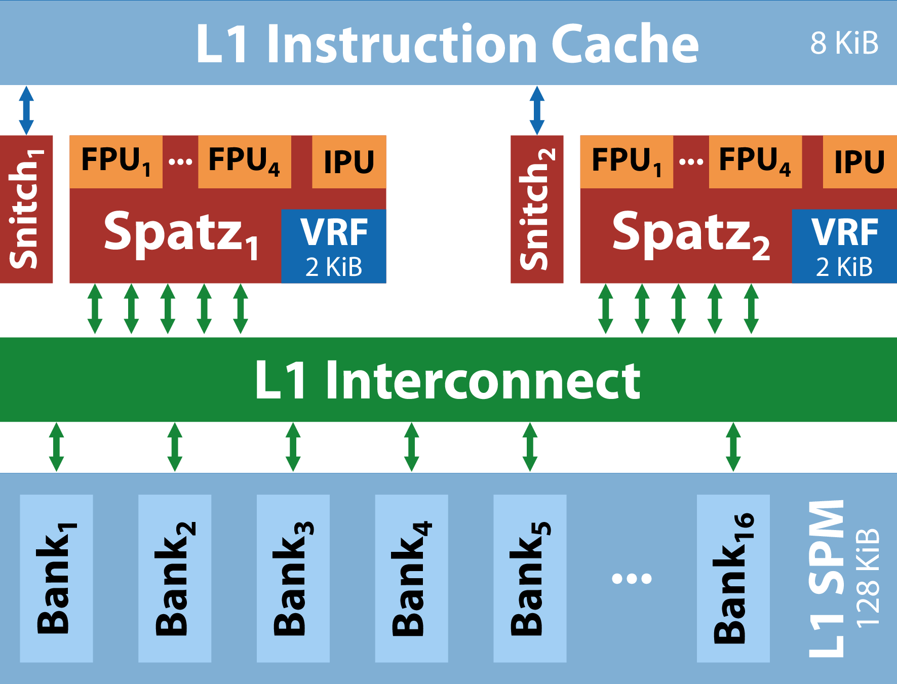
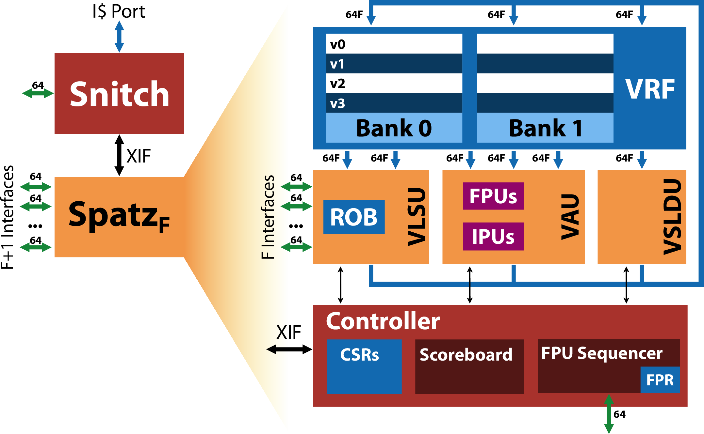

[](https://opensource.org/licenses/Apache-2.0)

# Spatz

Spatz is a compact vector processor based on [RISC-V's Vector Extension (RVV) v1.0](https://github.com/riscv/riscv-v-spec/releases/tag/v1.0). Spatz acts as a coprocessor of [Snitch](https://github.com/pulp-platform/snitch), a tiny 64-bit scalar core. It is developed as part of the PULP project, a joint effort between ETH Zurich and the University of Bologna.

## Getting started

Make sure you download all necessary dependencies:

```bash
make all
```

The Makefile target will automatically download and compile tested versions of LLVM, GCC, Spike, and Verilator. It might take a while. If you have issues cloning the GitHub modules, you might need to remove the folders in `sw/toolchain`.

ETH users can source the toolchains and initialize the environment by doing:

```bash

source util/iis-env.sh

make init
```

The Spatz cluster system (hw/system/spatz_cluster) is a fundamental system around a Snitch core and a Spatz coprocessor. The cluster can be configured using a config file. The configuration parameters are documented using JSON schema, and documentation is generated for the schema. The cluster testbench simulates an infinite memory. The RISC-V ELF file is preloaded using RISC-V's Front-end Server (`fesvr`).

### Simulating the system

In `hw/system/spatz_cluster`:

- Compile the software and the binaries:
  - Verilator:
```bash
    make sw.vlt -B
```
  - QuestaSim:
```bash
    make sw.vsim -B
```
  - VCS:
```bash
    make sw.vcs -B
```
Note: -B is necessary to force build all spatz config related generated files

- Run a binary on the simulator:
  - Verilator:
```bash
bin/spatz_cluster.vlt path/to/riscv/binary
```
  - QuestaSim:
```bash
# Headless
bin/spatz_cluster.vsim path/to/riscv/binary
# GUI
bin/spatz_cluster.vsim.gui path/to/riscv/binary
```
  - VCS
```bash
bin/spatz_cluster.vcs path/to/riscv/binary
```
- Build the traces in `.logs/trace_hart_X.txt` with the help of `spike-dasm`:
```bash
make traces
```
- Annotate the traces in `.logs/trace_hart_X.s` with the source code related to the retired instructions:
```bash
make annotate
```
- Get an overview of all Makefile targets:
```bash
make help
```

#### Instruction traces

Pick the trace sink when building the RTL with `RTL_TRACE` (not to be confused
with `TRACE`, which controls snRuntime software tracing):

| | Output | Notes |
|---|---|---|
| `RTL_TRACE=plain` | `bin/logs/trace_hart_X.dasm` | default |
| `RTL_TRACE=gz` | `bin/logs/trace_hart_X.dasm.gz` | ~32x smaller, and faster than `plain` |
| `RTL_TRACE=off` | none | no tracer instantiated |

```bash
make bin/spatz_cluster.vsim RTL_TRACE=gz
```

`make traces` and `make annotate` accept either extension. To read a compressed
trace yourself, `gzip -dc` it; in Python, `gzip.open(path, 'rt')`.

With an `RTL_TRACE=gz` build, the backend can be changed per run without
rebuilding, and the file extension follows it:

```bash
bin/spatz_cluster.vsim +trace_mode=thr:gz1 path/to/binary   # faster, larger
bin/spatz_cluster.vsim +trace_mode=plain   path/to/binary   # writes .dasm
bin/spatz_cluster.vsim +trace_mode=null    path/to/binary   # discard
TW_MODE=thr:gz1 bin/spatz_cluster.vsim path/to/binary       # same, via env
```

| Mode | Effect |
|---|---|
| `thr:gz<1-9>` | worker thread deflates; **default is `thr:gz6`** |
| `thr:plain` | worker thread, no compression |
| `gz<1-9>` | deflate inline on the simulator thread — stalls it, avoid |
| `plain` | plain `fwrite` |
| `null` | discard |

Environment knobs: `TW_MODE` (backend, overrides `+trace_mode`), `TW_BLKSZ` and
`TW_NBLK` (handoff ring, default 256 KiB x 4 = 1 MiB per traced hart), `TW_LAT=1`
(print per-write latency percentiles at exit).

The defaults are sized for a real simulation and rarely need changing: an RTL
sim emits only ~2 MB/s of trace per hart, some 50x below what the writer can
absorb, so the tracer costs about 0.03% of run time either way. Tune only if you
are memory-constrained or care about what a crash loses.

| | Default | What it controls |
|---|---|---|
| `TW_BLKSZ` | 256 KiB | Handoff efficiency. **Do not shrink** - at 32 KiB the mean per-write cost goes from 9 ns to 1334 ns, worse than plain `$fwrite`. |
| `TW_NBLK` | 2 | Burst headroom, 512 KiB/hart. Real traces measure no worse at 2 than at 4; raise it only if a workload traces in large bursts. |
| `TW_GZBUF` | 64 KiB | How much trace a crash loses. No measurable cost at any size. |
| `TW_MODE` | `thr:gz6` | Backend, same values as `+trace_mode`. |
| `TW_LAT` | off | `=1` prints per-write latency percentiles at exit. |

If memory is tight the lever is `TW_NBLK`, never a smaller `TW_BLKSZ`.

**Crash behaviour.** If the simulator is killed, the `.gz` is still readable -
`gzip -dc` reports "unexpected end of file", exits non-zero, and prints
everything up to the cut. Every complete line before that point is intact and in
order; only the final line is cut mid-way. Measured at the real trace rate, a
`SIGKILL` loses ~900 KB with `thr:gz6` against ~690 KB for plain `$fwrite`,
which buffers too. `TW_GZBUF` is the only knob that moves this - the ring does
not, since it stays nearly empty at realistic rates.

### Configure the Cluster

To configure the cluster with a different configuration, either edit the configuration files in the `cfg` folder or create a new configuration file and pass it to the Makefile:

```bash
make bin/spatz_cluster.vlt CFG=cfg/spatz_cluster.default.hjson -B
```

The default config is in `cfg/spatz_cluster.default.hjson`. Alternatively, you can also set your `CFG` environment variable, the Makefile will pick it up and override the standard config.

## Architecture

### Spatz cluster

The Spatz cluster architecture consists of two Snitch-Spatz core complexes (CCs) sharing a L1 TCDM. The default L1 TCDM size is 128 KiB split into 16 banks 64-bit wide. The snitch in CC-0 is also a DMA capable to move data in and out of the L1 from L2. Spatz is parametric with several configurations of interest present in the `cfg/` folder. The default configuration is shown below.



### Spatz core

Each Spatz has three functional units:
- The Vector Arithmetic Unit (VFU), hosting `F` trans-precision FPUs and an integer computation unit. Each FPU supports fp8, fp16, fp32, and fp64 computation. Each IPU supports 8, 16, 32, and 64-bit computation. All units maintain a throughput of 64 bit/cycle regardless of the current Selected Element Width. The VFU also supports integer and floating-point reductions. Each CC has four [trans-precision FPUs](https://github.com/openhwgroup/cvfpu) with support for Spatz-specific SDOTP extensions for low-precision computing.
- The Vector Load/Store Unit (VLSU), with support for unit-strided, constant-strided, and indexed memory accesses. The VLSU supports a parametric number of 64-bit-wide memory interfaces. Thanks to the multiple narrow interfaces, Spatz can accelerate memory operations. By default, the number of 64-bit memory interfaces matches the number of FPUs in the design. **Important**, Spatz' VLSU cannot access the cluster's L2 memory. Ensure that all vector memory requests go to the local L1 memory (we provide the `snrt_l1alloc` and `snrt_dma_start_1d` functions for L1 initialization).
- The Vector Slide Unit (VSLDU) executes vector permutation instructions. As of now, we support vector slide up/down and vector moves.
- All functional units can read and write from the Vector Register File (VRF) implemented as a wide-word multi-ported latch based register file of default size 2KiB (VLEN=512-bit)

Each Spatz core is a 512-bit VLEN vector unit supporting the RVV 1.0 vector ISA specification. The spatz core is present in the repository [spatz_vpu](https://github.com/pulp-platform/spatz_vpu).
The spatz_vpu is not fully compliant and several instructions are being added at the moment.

Check [Ara](https://github.com/pulp-platform/ara) for an open-source vector processor fully compliant with RVV (and by the same authors!).
Thanks to its small size, Spatz is highly scalable, and we rely on multi-core vector processing to scale up the system.



### Supported instructions

The most up-to-date list of supported vector instructions can be found in `sw/riscvTests/CMakeLists.txt`. Spatz does not yet understand vector masking (although this is a work in progress), or fixed-point computation. It also does not understand many of the shuffling and permutation instructions of RVV (e.g., `vrgather`), and users are asked to shuffle data in memory through indexed memory operations. We very much welcome contributions that expand Spatz' capabilities as a vector coprocessor!

## License

Spatz is being made available under permissive open-source licenses.

The following files are released under Apache License 2.0 (`Apache-2.0`) see `LICENSE`:

- `sw/`
- `util/`
- `docs/schema`

The following files are released under Solderpad v0.51 (`SHL-0.51`) see `hw/LICENSE`:

- `hw/`

The following files are released under Creative Commons BY 4.0 (`CC-BY-4.0`) see `docs/fig/LICENSE`:

- `docs/fig`

The following directories contains third-party sources that come with their licenses. See the respective folder for the licenses used.

- `sw/snRuntime/vendor`
- `sw/toolchain/`
- `util/vendor`

## Publications

If you want to use Spatz, you can cite us:

```bibtex
@ARTICLE{Spatz2025,
  author  ={Perotti, Matteo and Riedel, Samuel and Cavalcante, Matheus and Benini, Luca},
  journal ={IEEE Transactions on Computer-Aided Design of Integrated Circuits and Systems},
  title   ={Spatz: Clustering Compact RISC-V-Based Vector Units to Maximize Computing Efficiency},
  year    ={2025},
  volume  ={44},
  number  ={7},
  pages   ={2488-2502},
  keywords={Computer architecture;Registers;Vector processors;Bandwidth;Energy efficiency;Graphics processing units;Memory management;Design automation;Random access memory;Computer architecture;embedded systems-on-chip;machine learning;RISC-V;vector processors},
  doi     ={10.1109/TCAD.2025.3528349}
}
@Article{Spatz2023,
  title         = {Spatz: Clustering Compact RISC-V-Based Vector Units to Maximize Computing Efficiency},
  author        = {Matheus Cavalcante and Matteo Perotti and Samuel Riedel and Luca Benini},
  year          = {2023},
  month         = sep,
  eprint        = {2309.10137},
  archivePrefix = {arXiv},
  primaryClass  = {cs.AR}
}
```
