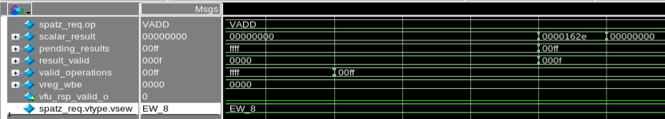
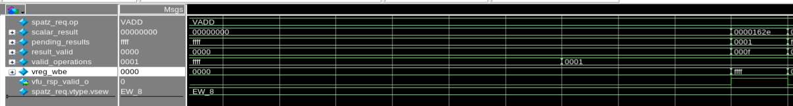

# Report: Fix vmv.x.s Deadlock in spatz_vfu.sv

## Problem

The RISC-V Vector instruction `vmv.x.s` (vector-to-scalar move) caused **deadlock** when executed in **RVD=0** configuration (ELEN=32). The system would hang indefinitely.

## Flow Leading to Deadlock

Here's the execution flow:

### 1. Decoder Set (spatz_decoder.sv line 47)
```systemverilog
always_comb begin : decoder
  spatz_req = '0;  // All fields set to zero, including vtype.vsew = EW_8
```

### 2. VMV.X.S Decode (spatz_decoder.sv lines 835-847)
```systemverilog
riscv_instr::VMV_X_S: begin
  spatz_req.op                 = VADD;
  spatz_req.ex_unit            = VFU;
  spatz_req.op_arith.is_scalar = 1'b1;
  spatz_req.vd_is_src          = 1'b1;
  spatz_req.use_vs2            = 1'b1;
  spatz_req.rd                 = insn.r_type.rd;
  spatz_req.vs2                = insn.r_type.rs2;
  spatz_req.vl                 = 1;
  // Does NOT set spatz_req.vtype.vsew → remains EW_8 from initial set!
end
```

At decode time, `vmv.x.s` sets `is_scalar = 1'b1` but does **not** set `vtype.vsew`, leaving it at the default `EW_8`.

### 3. Controller Override (spatz_controller.sv lines 410-421)
```systemverilog
if (spatz_req.op_arith.is_scalar) begin
  spatz_req.vtype = buffer_spatz_req.vtype;  // Uses buffered vtype with vsew=EW_8
  spatz_req.vl    = 1;
  // CSR vtype_q (containing vsetvli value) is IGNORED
end
```

### 4. VFU Error (spatz_vfu.sv line 142)

```systemverilog
assign pending_results = result_tag.wb ? (spatz_req.vtype.vsew == EW_32 ? 4'hf : 8'hff) : '1;
```

**The Bug**: Hardcoded logic with only 2 cases:
- `vsew == EW_32` → expects 4 bytes ✓
- **Otherwise** → expects 8 bytes ✗ **WRONG for e8 and e16 with ELEN=32!**

Since controller always passes `vsew=EW_8` for scalar operations, VFU expects 8 bytes but IPU produces only 4 bytes (ELEN=32 limit).

## Deadlock Mechanism

The ready check at line 448:
```systemverilog
result_ready = &(result_valid | ~pending_results) && ((result_tag.wb && vfu_rsp_ready_i) || vrf_wvalid_i);
```

**With vsew=EW_8, RVD=0 (ELEN=32):**
```
pending_results = 8'hff = 0b00001111_1111  (expects 8 bytes)
result_valid    = 4'hf  = 0b00000000_1111  (IPU produces 4 bytes)

&(0b00001111 | 0b11110000_0000) = &(0b11110000_1111) = 0  ← DEADLOCK!
```

Bits 4-7 remain zero forever → `result_ready = 0` → instruction never completes.

## Scalar Result Extraction

```systemverilog
// spatz_vfu.sv - Result selection and extraction
assign result       = state_q == VFU_RunningIPU ? ipu_result       : fpu_result;
assign result_valid = state_q == VFU_RunningIPU ? ipu_result_valid : fpu_result_valid;

assign scalar_result = result[ELEN-1:0];

// Send scalar result to CPU when instruction completes
if ((result_tag.last && &(result_valid | ~pending_results) && ...) || reduction_done) begin
  vfu_rsp_o.id     = result_tag.id;
  vfu_rsp_o.rd     = result_tag.vd_addr[GPRWidth-1:0];
  vfu_rsp_o.wb     = result_tag.wb;
  vfu_rsp_o.result = result_tag.wb ? scalar_result : '0;  // Write to GPR rd
  vfu_rsp_valid_o  = 1'b1;
end
```

**The deadlock prevents this writeback** because the condition `&(result_valid | ~pending_results)` never becomes true, so `vfu_rsp_valid_o` is never asserted and the CPU never receives the result.



## Why It Worked with RVD=1

With RVD=1 (ELEN=64), the IPU produces 8 bytes even for e8:
```
pending_results = 8'hff (expects 8 bytes)
result_valid    = 8'hff (IPU produces 8 bytes with ELEN=64)
&(0xff | ~0xff) = 1 ✓  No deadlock by coincidence!
```

The bugs "cancel out" because ELEN=64 produces exactly what the incorrect logic expects.

## Solution

Replace hardcoded logic with a reusable function that dynamically computes byte masks based on `vsew`:

```systemverilog
// Function to compute valid byte mask based on element width
function automatic logic [N_FU*ELENB-1:0] get_valid_bytes(vew_e vsew);
  case (vsew)
    EW_8:  return {{(N_FU*ELENB-1){1'b0}}, 1'h1};   // 1 byte
    EW_16: return {{(N_FU*ELENB-2){1'b0}}, 2'h3};   // 2 bytes
    EW_32: return {{(N_FU*ELENB-4){1'b0}}, 4'hf};   // 4 bytes
    EW_64: return {{(N_FU*ELENB-8){1'b0}}, 8'hff};  // 8 bytes
    default: return '1;
  endcase
endfunction

// Valid operations
logic [N_FU*ELENB-1:0] valid_operations;
assign valid_operations = (spatz_req.op_arith.is_scalar || spatz_req.op_arith.is_reduction) ? 
                          get_valid_bytes(spatz_req.vtype.vsew) : '1;

// Pending results
logic [N_FU*ELENB-1:0] pending_results;
assign pending_results = result_tag.wb ? get_valid_bytes(spatz_req.vtype.vsew) : '1;
```

This correctly handles all element widths (e8, e16, e32, e64) regardless of what vsew value the decoder/controller provides.

